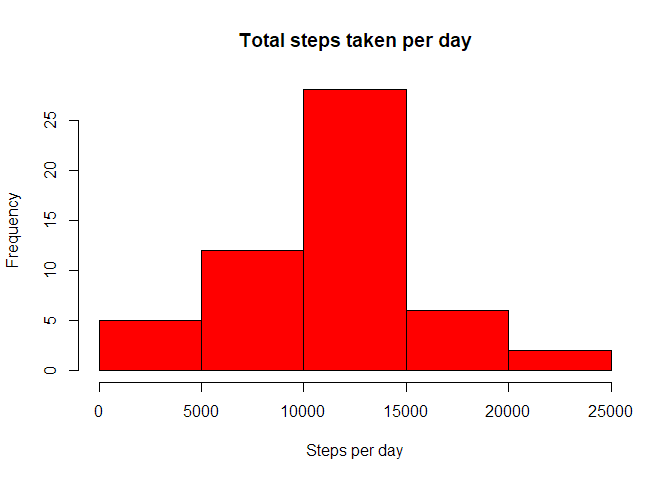
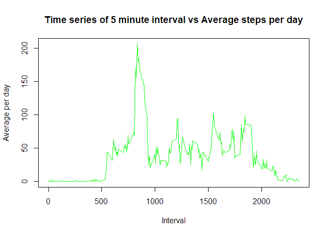
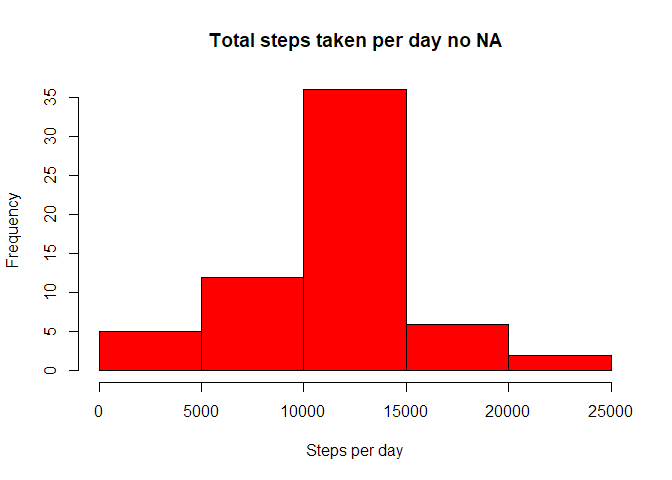
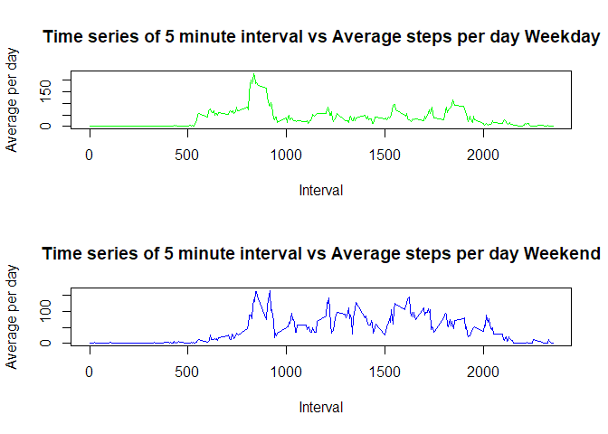

# Reproducible Research Project 1
Vinicio De Sola  
January 4, 2018  


# Introduction

We are going to use the dataset provided in [Here][1] for some basic exploratory analysis. The main variables included in this dataset are

- **steps**  
- **date**  
- **interval**  

The description of these variables is on the exercise, so I decided to omitted here for compactness.


[1]: https://d396qusza40orc.cloudfront.net/repdata%2Fdata%2Factivity.zip

## Loading and preprocessing the data

Our first step is to download and load the data. We can assume that the data is already in the same directory that we are working on, or we can create a chunk code that look for the data in the directory, and if is not there, downloads it.


```r
if(!file.exists("repdata%2Fdata%2Factivity.zip")){
        fileURL <- "https://d396qusza40orc.cloudfront.net/repdata%2Fdata%2Factivity.zip"
        download.file(fileURL,destfile = "repdata%2Fdata%2Factivity.zip", mode = "wb")
} ## Check for the zip
if(!file.exists("activity.csv")){
        unzip("repdata%2Fdata%2Factivity.zip")
} ## Check for the csv file
data <- read.csv('activity.csv', header = TRUE)
head(data)
```

```
##   steps       date interval
## 1    NA 2012-10-01        0
## 2    NA 2012-10-01        5
## 3    NA 2012-10-01       10
## 4    NA 2012-10-01       15
## 5    NA 2012-10-01       20
## 6    NA 2012-10-01       25
```

```r
str(data)
```

```
## 'data.frame':	17568 obs. of  3 variables:
##  $ steps   : int  NA NA NA NA NA NA NA NA NA NA ...
##  $ date    : Factor w/ 61 levels "2012-10-01","2012-10-02",..: 1 1 1 1 1 1 1 1 1 1 ...
##  $ interval: int  0 5 10 15 20 25 30 35 40 45 ...
```

```r
summary(data$steps)
```

```
##    Min. 1st Qu.  Median    Mean 3rd Qu.    Max.    NA's 
##    0.00    0.00    0.00   37.38   12.00  806.00    2304
```

The data is simple enough and is tidy. There are several NA's, but we'll deal with these later. Our main concern right now is with the variable steps. We can subset the data by day. 

## What is mean total number of steps taken per day?

Let's start our first exploratory analysis, delving deeper into the data. Our first question is how many steps are taken by each day (not the total). We are working with 53 days in total. Then, we will plot a histogram of the total steps per day, and finally the mean and the median of the total steps taken per day.

### 1.- Total steps taken per day


```r
total_steps <- aggregate(steps~date,data = data,sum,na.rm=TRUE)
total_steps
```

```
##          date steps
## 1  2012-10-02   126
## 2  2012-10-03 11352
## 3  2012-10-04 12116
## 4  2012-10-05 13294
## 5  2012-10-06 15420
## 6  2012-10-07 11015
## 7  2012-10-09 12811
## 8  2012-10-10  9900
## 9  2012-10-11 10304
## 10 2012-10-12 17382
## 11 2012-10-13 12426
## 12 2012-10-14 15098
## 13 2012-10-15 10139
## 14 2012-10-16 15084
## 15 2012-10-17 13452
## 16 2012-10-18 10056
## 17 2012-10-19 11829
## 18 2012-10-20 10395
## 19 2012-10-21  8821
## 20 2012-10-22 13460
## 21 2012-10-23  8918
## 22 2012-10-24  8355
## 23 2012-10-25  2492
## 24 2012-10-26  6778
## 25 2012-10-27 10119
## 26 2012-10-28 11458
## 27 2012-10-29  5018
## 28 2012-10-30  9819
## 29 2012-10-31 15414
## 30 2012-11-02 10600
## 31 2012-11-03 10571
## 32 2012-11-05 10439
## 33 2012-11-06  8334
## 34 2012-11-07 12883
## 35 2012-11-08  3219
## 36 2012-11-11 12608
## 37 2012-11-12 10765
## 38 2012-11-13  7336
## 39 2012-11-15    41
## 40 2012-11-16  5441
## 41 2012-11-17 14339
## 42 2012-11-18 15110
## 43 2012-11-19  8841
## 44 2012-11-20  4472
## 45 2012-11-21 12787
## 46 2012-11-22 20427
## 47 2012-11-23 21194
## 48 2012-11-24 14478
## 49 2012-11-25 11834
## 50 2012-11-26 11162
## 51 2012-11-27 13646
## 52 2012-11-28 10183
## 53 2012-11-29  7047
```

### 2.- Histogram


```r
hist(total_steps$steps, ylab="Frequency", xlab = "Steps per day", 
     main = "Total steps taken per day",
     col = "red")
```

<!-- -->

### 3.- Mean and Median


```r
mean(total_steps$steps)
```

```
## [1] 10766.19
```

```r
median(total_steps$steps)
```

```
## [1] 10765
```

From the histogram and the last two values, we can observe some normality in the data, a bell curve.

## What is the average daily activity pattern?

Now we are going to create time series To keep consistency of measurement, we are going to use the 5-minute interval as a factor for subsetting the data, this is our x-axis. Our y-axis will be the average number of steps taken, averaged across all days 

### 1.- Time series


```r
steps_5min <- aggregate(steps~interval,data = data,mean,na.rm=TRUE)
plot(steps_5min$interval, steps_5min$steps, xlab = 'Interval', 
     ylab = 'Average per day',
     type = 'l', col='green', 
     main='Time series of 5 minute interval vs Average steps per day')
```

<!-- -->

### 2.- Maximum number of steps on average


```r
id_interval <- which.max(steps_5min$steps)
max_interval <- steps_5min[id_interval,]$interval
max_steps <- steps_5min[id_interval,]$steps
print(paste("Max number of steps on average is ",round(max_steps,2), " and occurs in interval ",max_interval))
```

```
## [1] "Max number of steps on average is  206.17  and occurs in interval  835"
```

From the previous analysis we can presume that the person started to do exercise a couple of days after getting the device, had a peak, and then went back to a sedentary life. 

## Imputing missing values

Now we are going to take care of the missing values NA's. First let's see how many NA's are in our dataset. We already seen it on the summary table of steps

### 1.- Number of NA's


```r
number_NA <- sum(is.na(data))
print(paste("The number of NA's is ", number_NA))
```

```
## [1] "The number of NA's is  2304"
```

```r
percen <- number_NA/length(data$steps)
print(paste("The % of NA's in the dataset is ", round(percen,4)*100))
```

```
## [1] "The % of NA's in the dataset is  13.11"
```

So we are working we about 13% of NA's, a large percentage that bias our results. Let's now work in a way of filling this NA's so is not that biased. 

### 2.- Strategy to fill the NA's

Of the many strategies presented, the one that makes the most sense to me is using the mean of the interval, to make sure that we have measurement all across the dataset. According to our previous analysis, the distribution seems to be normal, so using mean or median shouldn't affect the result that much.

### 3.- New dataset with the strategy implemented


```r
data_rNA <- data
n <- length(data_rNA$steps)
for (i in 1:n){
    if(is.na(data_rNA$steps[i])){
        data_rNA$steps[i]<-steps_5min$steps[
                            which(steps_5min$interval==data_rNA$interval[i])]
    }
}
head(data_rNA)
```

```
##       steps       date interval
## 1 1.7169811 2012-10-01        0
## 2 0.3396226 2012-10-01        5
## 3 0.1320755 2012-10-01       10
## 4 0.1509434 2012-10-01       15
## 5 0.0754717 2012-10-01       20
## 6 2.0943396 2012-10-01       25
```

### 4.- New histogram, mean, and median


```r
total_stepsNA <- aggregate(steps~date,data = data_rNA,sum,na.rm=TRUE)
hist(total_stepsNA$steps, ylab="Frequency", xlab = "Steps per day", 
     main = "Total steps taken per day no NA",
     col = "red")
```

<!-- -->

```r
mean(total_stepsNA$steps) ## Mean
```

```
## [1] 10766.19
```

```r
median(total_stepsNA$steps) ## Median
```

```
## [1] 10766.19
```

The distribution is practically the same. Because we replaced NA's with means, we could expect that the mean wouldn't change because of the linearity of the mean operator. The median is shifted to the mean, but in a small value. This data set is even more well-behaved or more bell-curve shaped.

## Are there differences in activity patterns between weekdays and weekends?

For this part we will create a new factor, using the function weekdays(). The idea is to check if the patterns are different between weekday or weekends. 

### 1.- Create a new factor variable


```r
data_rNA['Weekends'] <- weekdays(as.Date(data_rNA$date))
data_rNA$Weekends[data_rNA$Weekends %in% c('Saturday', 'Sunday')] <- 'Weekend'
data_rNA$Weekends[data_rNA$Weekends != 'Weekend'] <- 'Weekday'
data_rNA$Weekends <- as.factor(data_rNA$Weekends) ## Create the factor
head(data_rNA)
```

```
##       steps       date interval Weekends
## 1 1.7169811 2012-10-01        0  Weekday
## 2 0.3396226 2012-10-01        5  Weekday
## 3 0.1320755 2012-10-01       10  Weekday
## 4 0.1509434 2012-10-01       15  Weekday
## 5 0.0754717 2012-10-01       20  Weekday
## 6 2.0943396 2012-10-01       25  Weekday
```

### 2.- Create a panel plot using time series


```r
par(mfrow=c(2,1))
steps_5minNA <- aggregate(steps~interval+Weekends,data =
                              data_rNA,mean,na.rm=TRUE)
w_day <- which(steps_5minNA$Weekends=='Weekday')
w_end <- which(steps_5minNA$Weekends=='Weekend') 
plot(steps_5minNA$interval[w_day], steps_5minNA$steps[w_day], 
     xlab = 'Interval', 
     ylab = 'Average per day',
     type = 'l', col='green', 
     main='Time series of 5 minute interval vs Average steps per day Weekday')
plot(steps_5minNA$interval[w_end], steps_5minNA$steps[w_end], 
     xlab = 'Interval', 
     ylab = 'Average per day',
     type = 'l', col='blue', 
     main='Time series of 5 minute interval vs Average steps per day Weekend')
```

<!-- -->

As a final comment, the time series of the weekend seems more distributed across the expectrum of intervals, the weekday is more concentrated in the lower half of the day.
